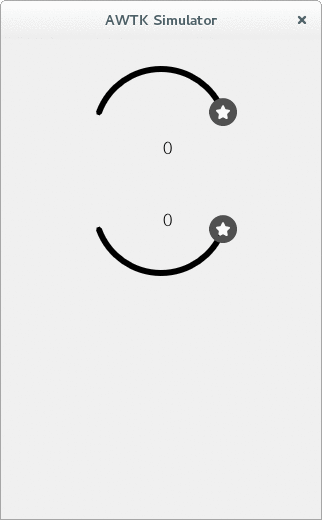

# awtk 扩展控件实例：圆形滑块

滑块组件是 gui 中的一种常见组件，用户可以通过拖动滑块来增大、减少预设的值。

awtk 中提供了一种滑块的基本实现，这个组件是 slider。awtk 支持垂直、水平两种方向的 slider，如果没有进一步的需求，这种实现便能够很好的工作。如果你觉得这种简单的 slider 显示效果差强人意，首先你可以通过设置 style 的方式来看看能不能实现你想要的效果，设定 style 后仍旧不能得到满意的效果，那么你可以自己编写扩展组件。

这篇文章以实际应用中对滑块组件的不同需求为例，通过叙述圆形滑块扩展组件的实现来介绍如何在 awtk 中扩展组件。

### awtk 中的组件继承关系

awtk 中的组件大都继承自 widget 控件。下面是 widget 控件结构体中的部分内容：

```c
struct _widget_t {
	/**
     * @property {xy_t} x
     * @annotation ["set_prop","get_prop","readable","persitent","design","scriptable"]
     * x坐标(相对于父控件的x坐标)。
     */
    xy_t x;
    /**
     * @property {xy_t} y
     * @annotation ["set_prop","get_prop","readable","persitent","design","scriptable"]
     * y坐标(相对于父控件的y坐标)。
     */
    xy_t y;
    /**
     * @property {wh_t} w
     * @annotation ["set_prop","get_prop","readable","persitent","design","scriptable"]
     * 宽度。
     */
    wh_t w;
    /**
     * @property {wh_t} h
     * @annotation ["set_prop","get_prop","readable","persitent","design","scriptable"]
     * 高度。
     */
    wh_t h;
    /**
     * @property {char*} name
     * @annotation ["set_prop","get_prop","readable","persitent","design","scriptable"]
     * 控件名字。
     */
    char* name;
    /**
     * @property {char*} tr_text
     * @annotation ["set_prop","get_prop","readable","persitent","design","scriptable"]
     * 保存用于翻译的字符串。
     */
    char* tr_text;
    /**
     * @property {char*} style
     * @annotation ["set_prop","get_prop","readable","persitent","design","scriptable"]
     * style的名称。
     */
    char* style;
    /**
     * @property {char*} animation
     * @annotation ["set_prop","get_prop","readable","persitent","design","scriptable"]
     * 动画参数。请参考[控件动画](https://github.com/zlgopen/awtk/blob/master/docs/widget_animator.md)
     */
		
    .....
	
    /**
     * @property {widget_vtable_t} vt
     * @annotation ["readable"]
     * 虚函数表。
     */
    const widget_vtable_t* vt;
};
		
```

widget 控件是对各种控件功能与行为的抽象，其中既描述了组成一个控件的基础元素，如控件坐标、大小、名称、style 等，也描述了用户对控件的基础操作，如创建控件、设置控件属性、获取控件属性、绘制控件、控件事件响应等。

对于扩展控件而言，我们只需要继承 widget 控件，添加新的属性，实现部分或全部虚函数表中的函数即可。

### 扩展控件类的设计

awtk 主要用 c 语言开发，这里描述的类就是 c 语言中的结构体内容，这也是使用 c 语言实现面向对象的一种常见方法。

根据圆形滑块的特点，设计结构体内容，将此扩展组件命名为 slider_circle。slider_circle 控件结构体部分内容如下：

```c
/** 
 * @class slider_circle_t
 * @parent widget_t
 * @annotation ["scriptable", "design", "widget"]
 * circle slider
 *
 */
	
typedef struct _slider_circle_t {
    widget_t widget;
	
    /** 
     * @property {uint16_t} value
     * @annotation ["set_prop", "get_prop", "readable", "persitent", "design", "scriptable"]
     * 值 (默认为０)
     */
    uint16_t value;
	    
    /**
     * @property {uint16_t} min
     * @annotation ["set_prop","get_prop","readable","persitent","design","scriptable"]
     * 最小值
     */
    uint16_t min;
	   
    ..... 
	   
    /* private */
    float_t rad;

    .....
} slider_circle_t;
```
	
上面的结构体中使用注释区分类的公有、私有属性，这是使用 c 语言实现面向对象的一种常见方法。在 awtk 中类的公有属性是只读的，用户不应该直接去修改它们。对于这些公有属性用户可以直接读取，不提供 get 函数。对于私有属性而言，用户无法直接修改、直接查看，只用于内部访问。

### 实现虚函数表中的函数

widget 中对控件方法的描述放在虚函数表中。虚函数表中的函数是对控件行为的抽象，根据控件的特点选择性的实现这些函数，然后注册到虚函数表中。

下面是圆形滑块中需要实现的函数：
	
```c	
struct _widget_vtable_t {
    uint32_t size;
    const char* type;
    /*克隆widget时需要复制的属性*/
    const char** clone_properties;
    /*持久化widget时需要保存的属性*/
    const char** persistent_properties;
	 
    .....
	
	
    widget_create_t create;
    widget_get_prop_t get_prop;
    widget_set_prop_t set_prop;
	  
    .....
	 
    widget_on_paint_self_t on_paint_self;
    widget_on_event_t on_event;
	
    .....
};
```

对于没有实现的函数，将会使用缺省实现。

#### 控件的 create 函数

create 函数类似于面向对象语言中的构造函数。在这个构造函数中创建对象，设置对象的默认值（如果存在），设置父控件，绑定虚函数表。

圆形滑块的构造函数代码如下：

```c	
widget_t* slider_circle_create(widget_t* parent, xy_t x, xy_t y, wh_t w, wh_t h) {
    widget_t* widget = widget_create(parent, TK_REF_VTABLE(slider_circle), x, y, w, h);
    slider_circle_t* slider_circle = SLIDER_CIRCLE(widget);
    return_value_if_fail(slider_circle != NULL, NULL);
	
    slider_circle->max = 100;
    slider_circle->min = 0;
    slider_circle->line_width = 6;
    slider_circle->start_angle = 0;
    slider_circle->end_angle = 180;
    slider_circle->step = 1;
    slider_circle->counter_clock_wise = FALSE;
	    
    return widget;
}
```	

#### 控件的销毁函数

由于圆形滑块类属性没有使用动态创建的内容，在这里我们不需要提供销毁函数。

#### 控件属性的 set、get 函数

set_prop、get_prop 函数是修改、读取类中公有属性的方法。通过使用通用数据类型 value_t，对类中属性的访问接口得到了统一。

为了方便用户使用，对于控件中的公有属性，awtk 提供相应的 set 函数来修改属性的值。下面的函数就是用来设置圆形滑块线宽的 api。

```c
ret_t slider_circle_set_line_width(widget_t* widget, uint32_t line_width); 
```
	
下面是 set_prop 函数的部分代码:
	
```c
static ret_t slider_circle_set_prop(widget_t* widget, const char* name, const value_t* v) {
    ......
	    
    return_value_if_fail(widget != NULL && name != NULL && v != NULL, RET_BAD_PARAMS);
			
    if (tk_str_eq(name, SLIDER_CIRCLE_PROP_COUNTER_CLOCK_WISE)) {
        return slider_circle_set_counter_clock_wise(widget, value_bool(v));
    } else if (tk_str_eq(name, SLIDER_CIRCLE_PROP_LINE_WIDTH)) {
        return slider_circle_set_line_width(widget, value_int(v));
    } 
		
    ......
			
        return RET_NOT_FOUND;
}
```

上面的 set_prop 函数可以看做是对公有属性 set 函数的封装，这种进一步的封装将设置属性的接口统一，主要用于 awtk 绑定的外部脚本对类成员属性的设定，以及从资源文件中加载控件时对属性的设定。

#### 控件的绘制方法

控件的绘制方法通过实现下面的函数来完成，实际绘制流程与下面列举的顺序一致。

```c
widget_on_paint_begin_t on_paint_begin;            /* 绘制开始 */
widget_on_paint_background_t on_paint_background;  /* 绘制背景 */
widget_on_paint_self_t on_paint_self;              /* 绘制自身 */
widget_on_paint_children_t on_paint_children;      /* 绘制子控件 */
widget_on_paint_border_t on_paint_border;          /* 绘制边框 */
widget_on_paint_end_t on_paint_end;                /* 绘制结束 */
```
>注意上述函数使用的 canvas 对象由 window_manager_paint 函数在绘制时传入，这里我们直接使用即可。


根据控件的特点，上面的函数可以选择实现。在虚函数表中未设定的函数，widget 控件中的默认函数将会执行。如果你确定你不需要做任何工作，那么你可以使用 *widget_on_paint_null 来赋值给相应的函数指针*。

在圆形滑块中，on_paint_border、on_paint_background 使用空实现。由 on_paint_self 这个函数来完成绘制控件的过程。

对于圆形滑块，绘制过程可以分为三部分：

>1. 绘制尚未拖动过的区域（圆弧）
>
>2. 绘制已经拖动过区域（圆弧）
>
>3. 绘制拖动的浮标位置	


通过调用 canvas 的 api 接口来完成绘制。绘制圆弧时使用控件的宽度与高度以及线宽（默认为 6）来计算圆心坐标与半径。绘制浮标位置时，先通过当前值计算出浮标的坐标，适当补偿一定大小后进行绘制。canvas 相关函数使用，可以参考 [The HTML5 canvas  handbook](http://bucephalus.org/text/CanvasHandbook/CanvasHandbook.html#rotate-angle) 。

部分代码如下：

```c	
static ret_t slider_circle_on_paint_self(widget_t* widget, canvas_t* c) {
    ... 
	
    slider_circle_paint_arc(widget, c, empty_color,
                            TK_D2R(start_angle),
                            TK_D2R(end_angle), NULL);
    ... 
        
	slider_circle_paint_arc(widget, c, empty_color,
                            TK_D2R(start_angle),
                            TK_D2R(end_angle), has_image ? &img : NULL);
    
    slider_circle_paint_dragger(widget, c);
}
```

#### 绘制过程中对主题的引用
	
awtk 中支持主题，可以针对每一个控件单独编写不同的主题，通过切换主题，就能够做出不同的效果。

主题由 xml 文件描述，通过 themegen 转化生成资源文件，然后被注册到资源管理器中。当指定的主题不存在时，默认的控件主题会被使用。更多的信息请参考 [awtk 中的主题](https://github.com/zlgopen/awtk/blob/master/docs/theme.md) 。

当用户在编写扩展控件时，对于能够通过主题来改变的属性，可以从控件的主题中获取，这样当控件完成后，不需要修改代码，只需要修改主题文件中指定的不同属性就能够设定不同的显示效果。

获取主题中的属性使用 style_get_xx 方法，下面是一个具体的例子：

```c
style_t* style = widget->astyle;
color = style_get_color(style, STYLE_ID_BORDER_COLOR, trans);
```

#### 控件的事件处理方法

awtk 中的事件有四种类型：

>1. 触摸事件（按下、移动、释放等）
>2. 按键事件（按下、释放）
>3. 添加空闲事件
>4. 添加定时器事件
>
			
awtk 的主循环中捕获事件并分发事件。对于一个控件而言，一般情况下只需要关注触摸事件即可。与触摸事件相关的函数如下：

```c
widget_on_pointer_down_t on_pointer_down;
widget_on_pointer_move_t on_pointer_move;
widget_on_pointer_up_t on_pointer_up;
widget_on_event_t on_event;
```
当一个触摸事件被捕获后，在最终的事件处理中，awtk 会先调用 widget_dispatch 分发事件，然后调用控件虚函数表中已经注册的相应事件处理函数。

对于指针按下事件而言，先执行 widget_dispatch 意味着如果控件实现了 on_event 函数，此函数会首先执行。此后，如果控件实现了 on_pointer_down 函数，那么此函数也会被调用执行。这种处理过程意味着我们既可以单独实现每一种事件的处理函数，也可以在 on_event 中统一处理不同事件。

圆形滑块控件在 on_event 函数中统一处理事件。主要逻辑如下：

>1. 指针按下时判断是否在浮标范围内，在则设置 dragging 为真，表示能够拖动
>
>2. 指针移动时，如果 dragging 为真则根据角度设定滑块的值，向滑块分发值改变中事件
>
>3. 指针释放时，如果 dragging 为真则设置为假，并设定滑块的值，向滑块分发值已经改变事件

在上面的处理过程中，当滑块的值改变时，invalidate 控件，控件将在下一次绘制逻辑执行时进行重绘。部分代码逻辑如下：

```c
.....
    
switch (type) {
 case EVT_POINTER_DOWN: {
    
     .....
     
     break;
 }
 case EVT_POINTER_MOVE: {
     .....
   	 
     break;
 }
 case EVT_POINTER_UP: {
     .....
     
     break;
}
```
 
#### 设置虚函数表
      
实现了上述函数，我们填充虚函数表。设置如下:

```c	
TK_DECL_VTABLE(slider_circle) = {.size = sizeof(slider_circle_t),
                                 .type = WIDGET_TYPE_SLIDER_CIRCLE,
                                 .clone_properties = s_slider_circle_properties,
                                 .persistent_properties = s_slider_circle_properties,
                                 .parent = TK_PARENT_VTABLE(widget),
                                 .create = slider_circle_create,
                                 .on_event = slider_circle_on_event,
                                 .on_paint_border = widget_on_paint_null,
                                 .on_paint_background = widget_on_paint_null,
                                 .on_paint_self = slider_circle_on_paint_self,
                                 .get_prop = slider_circle_get_prop,
                                 .set_prop = slider_circle_set_prop};
```
 
在上述虚函数表中，size 表示控件描述结构体的大小，在控件创建时申请 size 大小的空间。type 为控件的类型，使用字符串来表示。parent 表示控件的父控件，这里的父控件就指定为 widget 控件。
                                 
#### 使用代码创建控件

完成了上面的步骤，我们就可以通过代码来创建控件。

主要代码如下：

```c
ret_t create_slider_circle(widget_t* win, bool_t wise, const char* name) {
     widget_t* slider_circle = slider_circle_create(win, 0, 0, 0, 0);
     widget_t* label = label_create(slider_circle, 0, 0, 0, 0);
	 
     if (wise) {
         widget_set_self_layout_params(slider_circle, "c", "5%", "100%", "30%");
         slider_circle_set_start_angle(slider_circle, 200);
         slider_circle_set_end_angle(slider_circle, 340);
     } else {
         widget_set_self_layout_params(slider_circle, "c", "20%", "100%", "30%");
         slider_circle_set_start_angle(slider_circle, 20);
         slider_circle_set_end_angle(slider_circle, 160);
     }
	
     widget_layout(slider_circle);
	    
     widget_set_self_layout_params(label, "c", "50%", "20%", "20%");
     widget_layout(label);
     widget_set_text_utf8(label, "0");
	
     widget_on(slider_circle, EVT_VALUE_CHANGED, on_changed, label);
     widget_on(slider_circle, EVT_VALUE_CHANGING, on_changing, label);
	    
     slider_circle_set_counter_clock_wise(slider_circle, wise); 
     slider_circle_set_value(slider_circle, 0);
	
     widget_set_name(slider_circle, name);
	    
     return RET_OK;
}
```
	
上述代码中首先创建了一个圆形滑块控件，然后创建一个 label 作为滑块控件的子控件，用于显示滑块的当前值。这之后根据浮标不同的起始位置来设置滑块的位置、大小、开始、结束角度等等。

也许你会奇怪上面的代码中没有任何与绘制相关的部分，那么控件的绘制函数什么时候会被调用呢？

其实在创建控件的时候，awtk 会将控件的 dirty 属性设定为 TRUE，表明控件内容可能改变，在下一次绘制过程到来时，awtk 会通过脏矩形裁剪算法来裁剪出改变的区域，重绘改变的区域，并将相应控件的 dirty 属性修改为 FALSE。

上面的代码对 slider_circle 注册了值改变中的事件，拖动浮标时触发此事件，在事件函数中使用滑块的当前值设定 label，就看到了值的变化过程。

效果如下图：




#### 使用 style 

也许你会发现，效果图中圆形滑块的浮标与滑动时颜色的变化并没有在创建代码中发现，其实这些效果是通过设定 style 的形式来完成的。在绘制逻辑中通过从 style 中获取不同的属性来完成绘制，这样我们只需要为控件指定 style 即可看到不同的效果。

这里我为 slider_circle 设置的主题如下：

```xml
<slider_circle>
    <style name="default" icon="slider_drag">
    <normal fg_color="blue" bg_color="black"/>
    <pressed fg_color="blue" bg_color="black"/>
    <over     fg_color="blue" bg_color="black"/>
    </style>
</slider_circle>
```
icon 指定浮标，既可以是图片，也可以是普通颜色。normal、pressed、over 针对控件的不同状态可以设定不同的显示效果。fg_color 表示值增大方向圆弧的颜色，bg_color 表示值减小方向圆弧的颜色。
	
#### 使用 xml 描述控件

上文中描述了通过代码创建控件的方法，除了这种方式外，awtk 中还可以通过 xml 描述控件，通过解析 xml 文件来动态创建控件。在实际开发中尽可能的使用 xml 描述界面，这样既便于修改，又易于维护。

我们可以将 xml 文件看做一棵树，这棵树以根元素为起点，逐层描述了整个树的架构。

在 awtk 中，常见的方式是以 window 为根控件，描述出单个页面的树型结构。xml 中元素的属性在 awtk 中可以看做单个控件的属性，主要有名称属性、布局属性、style 属性 、私有属性等等。

一个简单的 xml 文件内容如下:

```xml
	<window>
	  <slider_circle style="image" x="c" y="0" w="200" h="200" name="circle" line_width="6" counter_clock_wise="FALSE" start_angle="180" end_angle="360">
	    <label name="value" x="c" y="bottom:30" w="20%" h="30%" text="０"/>
	  </slider_circle>	
	</window>
```

上面 xml 文件的内容中，以 window 为根控件，slider_circle 为 window 的子控件，label 为 slider_circle 的子控件。对于上面的内容在加载时的过程可以简单的描述如下：

	首先创建一个页面，然后在页面中创建一个子控件 slider_circle 并设定属性，然后创建一个 slider_circle 的子控件 label 并设定属性。

根据上面的描述，我们需要某段代码来完成 xml 文件的解析，然后根据元素名称调用相应的构造函数以文件中描述的父子关系创建控件，创建完成后控件属性的设定就通过调用上文中提到的控件的 set_prop 方法来设定属性。

这段代码由 ui_loader 完成。更多信息详见 [ui_loader_default](https://github.com/zlgopen/awtk/blob/master/src/ui_loader/ui_loader_default.c
)。
 
从元素名称找到相应的构造函数的过程有两种方式：

>1. 对于内部组件，构造函数在 *s_builtin_creators* 数组（位于 *src/base/widget_factory.c* 中）中注册。根据元素名称查询此数组就能获取到相应的构造函数。
>
>2. 对于外部组件，可以将控件动态注册到工厂中。这里的工厂是组件构造函数的容器，使用解析到的元素名称，通过查询此工厂容器，找到相应的创建方法，就能够创建出不同的控件（产品）。

　
这里，我使用如下代码将圆形滑块注册到工厂中。

```c
	widget_factory_register(widget_factory(), WIDGET_TYPE_SLIDER_CIRCLE, slider_circle_create);
```
上面的代码可以通过修改 widget_factory.c 文件来添加，不修改 awtk 代码时，可以将上述语句封装为函数，在 tk_init 函数调用后调用即可。

		
#### 类型检查
	
awtk 提供了多种控件，每一种控件对应一种类型。在实际编程中，当调用一个控件的方法去操作其它控件时，会产生不可预测的问题。为此，awtk 中提供了类型检查的方法，实际的类型检查通过递归检查控件的虚函数表类型是否一致来实现。

圆形滑块中使用如下代码来实现：

```c
widget_t* slider_circle_cast(widget_t* widget) {
    return_value_if_fail(WIDGET_IS_INSTANCE_OF(widget, slider_circle), NULL);
	
    return widget;
}
```

在头文件中创建 SLIDER_CIRCLE 宏，强转时使用此宏就能够进行类型检查。宏的内容如下：

>\#define SLIDER_CIRCLE(widget) ((slider_circle_t*)(slider_circle_cast(WIDGET(widget))))

当使能类型检查时，类型不一致则 SLIDER_CIRCLE 会返回 NULL；未使能类型检查时，类型不一致仅仅打印警告。

#### 生成文档

awtk 中每一种组件对应的头文件中加入了特殊的注释，通过解析这些注释便可以生成 idl（用于不同语言的绑定），通过进一步解析 idl，也可以生成每一种组件的 manual 文件。

解析器使用 js 编写，运行这些工具需要先安装 nodejs。

#### Debian 中安装 nodejs

```sh
sudo apt-get install curl 
curl -sL https://deb.nodesource.com/setup_8.x | sudo -E bash -
sudo apt-get install nodejs
```

#### 生成 idl 文件

在 idl_gen 中使用 js 脚本生成 idl 文件，这个脚本通过解析头文件中特殊的注释来工作，在脚本中有如下代码： 

```js
 gen.parseFolder('../../src/**/*.h');
```
 
上述代码指定了头文件的位置，这里需要将加入的头文件放到一个能够找到的位置。

```sh
cd awtk/tools/idl_gen
nodejs index.js
```
#### 生成 manual 文档

```sh
cd ../doc_gen
./gen.sh
```
