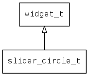

## slider\_circle\_t
### 概述


 圆形滑块
 slider\_circle\_t是[widget\_t](widget_t.md)的子类控件，widget\_t的函数均适用于slider\_circle\_t控件。

 在xml中使用"slider_circle"标签创建圆形滑块控件。如：

 ```xml
 <slider_circle x="c" y="100" w="100" h="120" name="circle" line_width="6" counter_clock_wise="TRUE" start_angle="0" end_angle="180"/>
 ```


 在c代码中使用函数slider\_circle\_create创建圆形滑块控件。如：

 ```c
    widget_t* slider_circle = slider_circle_create(win, 40, 40, 100, 120);
    widget_on(slider_circle, EVT_VALUE_CHANGED, on_changed, NULL);
    widget_on(slider_circle, EVT_VALUE_CHANGING, on_changing, NULL);
 ```

 > 完整示例请参考：
 [slider circle
 demo](http://git.zhaoqi.info:9998/awtk/awtk-slider-circle/blob/master/demos/slider_circle_test.c)

 可用通过style来设置控件的显示风格，如图片和颜色等等。如：

 ```xml
<style name="default" icon="slider_drag">
 <normal fg_color="blue" bg_color="black"/>
 <pressed fg_color="blue" bg_color="black"/>
 <pressed  fg_color="blue" bg_color="black"/>
 <over     fg_color="blue" bg_color="black"/>
</style>
 ```

 > 更多用法请参考：
 [theme
 default](https://github.com/zlgopen/awtk/blob/master/demos/assets/raw/styles/default.xml#L179)


----------------------------------
### 函数
<p id="slider_circle_t_methods">

| 函数名称 | 说明 | 
| -------- | ------------ | 
| <a href="#slider_circle_t_slider_circle_cast">slider\_circle\_cast</a> | 转换为slider_circle对象(供脚本语言使用) |
| <a href="#slider_circle_t_slider_circle_circle_set_max">slider\_circle\_circle\_set\_max</a> | 设置滑块的最大值 |
| <a href="#slider_circle_t_slider_circle_create">slider\_circle\_create</a> | 创建slider_circle对象 |
| <a href="#slider_circle_t_slider_circle_set_counter_clock_wise">slider\_circle\_set\_counter\_clock\_wise</a> | 设置浮标的起始位置 |
| <a href="#slider_circle_t_slider_circle_set_end_angle">slider\_circle\_set\_end\_angle</a> | 设置圆弧的结束角度 |
| <a href="#slider_circle_t_slider_circle_set_line_width">slider\_circle\_set\_line\_width</a> | 设置线宽 |
| <a href="#slider_circle_t_slider_circle_set_min">slider\_circle\_set\_min</a> | 设置滑块的最小值 |
| <a href="#slider_circle_t_slider_circle_set_start_angle">slider\_circle\_set\_start\_angle</a> | 设置圆弧的起始角度 |
| <a href="#slider_circle_t_slider_circle_set_step">slider\_circle\_set\_step</a> | 设置滑块的拖动的最小单位 |
| <a href="#slider_circle_t_slider_circle_set_value">slider\_circle\_set\_value</a> | 设置滑块的值。 |
### 属性
<p id="slider_circle_t_properties">

| 属性名称 | 类型 | 说明 | 
| -------- | ----- | ------------ | 
| <a href="#slider_circle_t_counter_clock_wise">counter\_clock\_wise</a> | bool\_t | 浮标的起始位置(默认为FALSE) |
| <a href="#slider_circle_t_end_angle">end\_angle</a> | int32\_t | 结束角度(单位为度，默认为180) |
| <a href="#slider_circle_t_line_width">line\_width</a> | uint32\_t | 环线的厚度(默认为6) |
| <a href="#slider_circle_t_max">max</a> | uint16\_t | 最大值(默认为100) |
| <a href="#slider_circle_t_min">min</a> | uint16\_t | 最小值(默认为0) |
| <a href="#slider_circle_t_start_angle">start\_angle</a> | int32\_t | 起始角度(单位为度，默认为0) |
| <a href="#slider_circle_t_step">step</a> | uint16\_t | 拖动的最小单位(默认为1) |
| <a href="#slider_circle_t_value">value</a> | uint16\_t | 滑块的值(默认为0) |
### 事件
<p id="slider_circle_t_events">

| 事件名称 | 类型  | 说明 | 
| -------- | ----- | ------- | 
| EVT\_VALUE\_WILL\_CHANGE | event\_t | 值即将改变事件 |
| EVT\_VALUE\_CHANGING | event\_t | 值正在改变事件(拖动中) |
| EVT\_VALUE\_CHANGED | event\_t | 值改变事件 |
#### slider\_circle\_cast 函数
-----------------------

* 函数功能：

> <p id="slider_circle_t_slider_circle_cast"> 转换为slider_circle对象(供脚本语言使用)


* 函数原型：

```
widget_t* slider_circle_cast (widget_t* widget);
```

* 参数说明：

| 参数 | 类型 | 说明 |
| -------- | ----- | --------- |
| 返回值 | widget\_t* | slider\_circle对象。 |
| widget | widget\_t* | slider\_circle对象 |
#### slider\_circle\_circle\_set\_max 函数
-----------------------

* 函数功能：

> <p id="slider_circle_t_slider_circle_circle_set_max"> 设置滑块的最大值


* 函数原型：

```
ret_t slider_circle_circle_set_max (widget_t* widget, uint16_t max);
```

* 参数说明：

| 参数 | 类型 | 说明 |
| -------- | ----- | --------- |
| 返回值 | ret\_t | 返回RET\_OK表示成功，否则表示失败 |
| widget | widget\_t* | 控件对象 |
| max | uint16\_t | 最大值 |
#### slider\_circle\_create 函数
-----------------------

* 函数功能：

> <p id="slider_circle_t_slider_circle_create"> 创建slider_circle对象


* 函数原型：

```
widget_t* slider_circle_create (widget_t* parent, xy_t x, xy_t y, wh_t w, wh_t h);
```

* 参数说明：

| 参数 | 类型 | 说明 |
| -------- | ----- | --------- |
| 返回值 | widget\_t* | 对象 |
| parent | widget\_t* | 父控件 |
| x | xy\_t | x坐标 |
| y | xy\_t | y坐标 |
| w | wh\_t | 宽度 |
| h | wh\_t | 高度 |
#### slider\_circle\_set\_counter\_clock\_wise 函数
-----------------------

* 函数功能：

> <p id="slider_circle_t_slider_circle_set_counter_clock_wise"> 设置浮标的起始位置


* 函数原型：

```
ret_t slider_circle_set_counter_clock_wise (widget_t* widget, bool_t counter_clock_wise);
```

* 参数说明：

| 参数 | 类型 | 说明 |
| -------- | ----- | --------- |
| 返回值 | ret\_t | 返回RET\_OK表示成功，否则表示失败 |
| widget | widget\_t* | 控件对象 |
| counter\_clock\_wise | bool\_t | 浮标的起始位置 |
#### slider\_circle\_set\_end\_angle 函数
-----------------------

* 函数功能：

> <p id="slider_circle_t_slider_circle_set_end_angle"> 设置圆弧的结束角度


* 函数原型：

```
ret_t slider_circle_set_end_angle (widget_t* widget, int32_t end_angle);
```

* 参数说明：

| 参数 | 类型 | 说明 |
| -------- | ----- | --------- |
| 返回值 | ret\_t | 返回RET\_OK表示成功，否则表示失败 |
| widget | widget\_t* | 控件对象 |
| end\_angle | int32\_t | 圆弧结束角度 |
#### slider\_circle\_set\_line\_width 函数
-----------------------

* 函数功能：

> <p id="slider_circle_t_slider_circle_set_line_width"> 设置线宽


* 函数原型：

```
ret_t slider_circle_set_line_width (widget_t* widget, uint16_t line_width);
```

* 参数说明：

| 参数 | 类型 | 说明 |
| -------- | ----- | --------- |
| 返回值 | ret\_t | 返回RET\_OK表示成功，否则表示失败 |
| widget | widget\_t* | 控件对象 |
| line\_width | uint16\_t | 圆弧线宽 |
#### slider\_circle\_set\_min 函数
-----------------------

* 函数功能：

> <p id="slider_circle_t_slider_circle_set_min"> 设置滑块的最小值


* 函数原型：

```
ret_t slider_circle_set_min (widget_t* widget, uint16_t min);
```

* 参数说明：

| 参数 | 类型 | 说明 |
| -------- | ----- | --------- |
| 返回值 | ret\_t | 返回RET\_OK表示成功，否则表示失败 |
| widget | widget\_t* | 控件对象 |
| min | uint16\_t | 最小值 |
#### slider\_circle\_set\_start\_angle 函数
-----------------------

* 函数功能：

> <p id="slider_circle_t_slider_circle_set_start_angle"> 设置圆弧的起始角度


* 函数原型：

```
ret_t slider_circle_set_start_angle (widget_t* widget, int32_t start_angle);
```

* 参数说明：

| 参数 | 类型 | 说明 |
| -------- | ----- | --------- |
| 返回值 | ret\_t | 返回RET\_OK表示成功，否则表示失败 |
| widget | widget\_t* | 控件对象 |
| start\_angle | int32\_t | 起始角度 |
#### slider\_circle\_set\_step 函数
-----------------------

* 函数功能：

> <p id="slider_circle_t_slider_circle_set_step"> 设置滑块的拖动的最小单位


* 函数原型：

```
ret_t slider_circle_set_step (widget_t* widget, uint16_t step);
```

* 参数说明：

| 参数 | 类型 | 说明 |
| -------- | ----- | --------- |
| 返回值 | ret\_t | 返回RET\_OK表示成功，否则表示失败 |
| widget | widget\_t* | 控件对象 |
| step | uint16\_t | 拖动的最小单位 |
#### slider\_circle\_set\_value 函数
-----------------------

* 函数功能：

> <p id="slider_circle_t_slider_circle_set_value"> 设置滑块的值。
 @anno tation ["scriptable"]


* 函数原型：

```
ret_t slider_circle_set_value (widget_t* widget, uint16_t value);
```

* 参数说明：

| 参数 | 类型 | 说明 |
| -------- | ----- | --------- |
| 返回值 | ret\_t | 返回RET\_OK表示成功，否则表示失败 |
| widget | widget\_t* | 控件对象 |
| value | uint16\_t | 值 |
#### counter\_clock\_wise 属性
-----------------------
> <p id="slider_circle_t_counter_clock_wise"> 浮标的起始位置(默认为FALSE)


* 类型：bool\_t

| 特性 | 是否支持 |
| -------- | ----- |
| 可直接读取 | 是 |
| 可直接修改 | 否 |
| 可持久化   | 是 |
| 可脚本化   | 是 |
| 可在IDE中设置 | 是 |
| 可在XML中设置 | 是 |
| 可通过widget\_get\_prop读取 | 是 |
| 可通过widget\_set\_prop修改 | 是 |
#### end\_angle 属性
-----------------------
> <p id="slider_circle_t_end_angle"> 结束角度(单位为度，默认为180) 


* 类型：int32\_t

| 特性 | 是否支持 |
| -------- | ----- |
| 可直接读取 | 是 |
| 可直接修改 | 否 |
| 可持久化   | 是 |
| 可脚本化   | 是 |
| 可在IDE中设置 | 是 |
| 可在XML中设置 | 是 |
| 可通过widget\_get\_prop读取 | 是 |
| 可通过widget\_set\_prop修改 | 是 |
#### line\_width 属性
-----------------------
> <p id="slider_circle_t_line_width"> 环线的厚度(默认为6)


* 类型：uint32\_t

| 特性 | 是否支持 |
| -------- | ----- |
| 可直接读取 | 是 |
| 可直接修改 | 否 |
| 可持久化   | 是 |
| 可脚本化   | 是 |
| 可在IDE中设置 | 是 |
| 可在XML中设置 | 是 |
| 可通过widget\_get\_prop读取 | 是 |
| 可通过widget\_set\_prop修改 | 是 |
#### max 属性
-----------------------
> <p id="slider_circle_t_max"> 最大值(默认为100)


* 类型：uint16\_t

| 特性 | 是否支持 |
| -------- | ----- |
| 可直接读取 | 是 |
| 可直接修改 | 否 |
| 可持久化   | 是 |
| 可脚本化   | 是 |
| 可在IDE中设置 | 是 |
| 可在XML中设置 | 是 |
| 可通过widget\_get\_prop读取 | 是 |
| 可通过widget\_set\_prop修改 | 是 |
#### min 属性
-----------------------
> <p id="slider_circle_t_min"> 最小值(默认为0)


* 类型：uint16\_t

| 特性 | 是否支持 |
| -------- | ----- |
| 可直接读取 | 是 |
| 可直接修改 | 否 |
| 可持久化   | 是 |
| 可脚本化   | 是 |
| 可在IDE中设置 | 是 |
| 可在XML中设置 | 是 |
| 可通过widget\_get\_prop读取 | 是 |
| 可通过widget\_set\_prop修改 | 是 |
#### start\_angle 属性
-----------------------
> <p id="slider_circle_t_start_angle"> 起始角度(单位为度，默认为0) 


* 类型：int32\_t

| 特性 | 是否支持 |
| -------- | ----- |
| 可直接读取 | 是 |
| 可直接修改 | 否 |
| 可持久化   | 是 |
| 可脚本化   | 是 |
| 可在IDE中设置 | 是 |
| 可在XML中设置 | 是 |
| 可通过widget\_get\_prop读取 | 是 |
| 可通过widget\_set\_prop修改 | 是 |
#### step 属性
-----------------------
> <p id="slider_circle_t_step"> 拖动的最小单位(默认为1)


* 类型：uint16\_t

| 特性 | 是否支持 |
| -------- | ----- |
| 可直接读取 | 是 |
| 可直接修改 | 否 |
| 可持久化   | 是 |
| 可脚本化   | 是 |
| 可在IDE中设置 | 是 |
| 可在XML中设置 | 是 |
| 可通过widget\_get\_prop读取 | 是 |
| 可通过widget\_set\_prop修改 | 是 |
#### value 属性
-----------------------
> <p id="slider_circle_t_value"> 滑块的值(默认为0)


* 类型：uint16\_t

| 特性 | 是否支持 |
| -------- | ----- |
| 可直接读取 | 是 |
| 可直接修改 | 否 |
| 可持久化   | 是 |
| 可脚本化   | 是 |
| 可在IDE中设置 | 是 |
| 可在XML中设置 | 是 |
| 可通过widget\_get\_prop读取 | 是 |
| 可通过widget\_set\_prop修改 | 是 |
